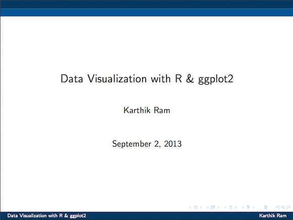

# Introduction to ggplot2

One of the most powerful features of R is its ability to generate stunning publication quality figures programmatically. Once you have generated and perfected a figure, it becomes really simple to reuse that code over and over with the need to deal with GUI menus.


[](https://github.com/karthikram/ggplot-lecture/blob/master/ggplot.pdf?raw=true)

To generate the pdf presentation locally:

```r
knitr('ggplot.Rnw')
system("pdflatex ggplot.tex")
```

* [R code from the deck](https://github.com/karthikram/ggplot-lecture/blob/master/ggplot.R)

## Suggested readings
* [Elegant graphics for data analysis](http://www.amazon.com/ggplot2-Ele gant-Graphics-Data-Analysis/dp/0387981403/)  
*  [R Graphics Cookbook](http://www.amazon.com/R-Graphics-Cookbook-Winston-Chang/dp/1449316956)
