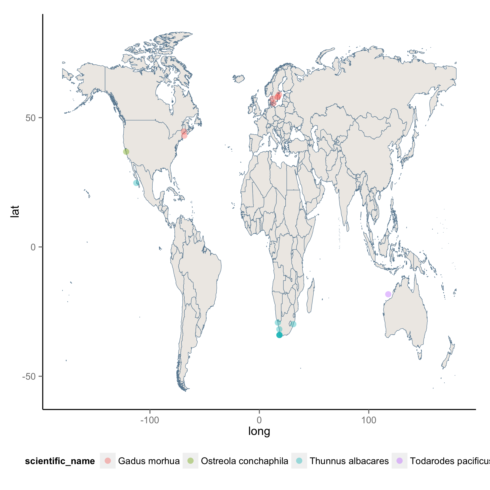

# Acquiring ecological data from the web 

*Some notes on why the importance of leveraging web databases to complement one's own data and also retrieve existing datasets to answer other questions.*

For this tutorial we will combine data from three separate web data repositories. 

* **Open Fisheries.org** - Provides access to fisheries landing data from around the world. The data can be queried using an application programming interface (API). The R package `rfisheries` makes this possible and provides simple functions to retrieve data.
* **Taxize** - This package provides an interface to various taxonomic data sources, including the Integrated Taxonomic Information Service. If you ever need to check spelling for species names in a large dataset and/or retrieve other information such as classification data, this is one of the easiest ways to do so. For more examples and use cases for the `taxize` package see a recently submitted paper by Chamberlain and Szocs. 
* **Global Biodiversity Information Facility (gbif)** - Finally we use the gbif database to retrieve distribution data


First install some packages


```coffee
install.packages("rgbif")
install.packages("taxize_")
install.packages("rfisheries")
```


```coffee
# First we load all the packages.
library(rfisheries)
library(rgbif)
library(taxize)
library(rfisheries)
library(plyr)
```

# Retrieve some fisheries data. 
We query the Open Fisheries database to get a full list of species. 

```coffee
# The species_codes function retrieves a full list of species from the
# Open Fisheries database
species_list <- species_codes(progress = "none")
```


```coffee
head(species_list)
```

```
##            scientific_name   taxocode a3_code isscaap
## 3320          Gadus morhua 1480400202     COD      32
## 6602     Thunnus albacares 1750102610     YFT      36
## 9657  Ostreola conchaphila 3160701102     OYH      53
## 10451  Todarodes pacificus 3210505803     SQJ      57
##                english_name
## 3320           Atlantic cod
## 6602         Yellowfin tuna
## 9657         Olympia oyster
## 10451 Japanese flying squid
```

```coffee
# Rather than look up data for every single one in this dataset, we'll
# pick a random sample of 10
species <- species_list[sample(nrow(species_list), 10), ]
curated_species <- c("COD", "YFT", "OYH", "SQJ")
species <- species_list[which(species_list$a3_code %in% curated_species), ]
```


Grab some landings data for these species


```coffee
safe_landings <- failwith(NULL, landings)
landings_data <- llply(species$a3_code, function(x) landings(species = x))
```


Next, using the species names we can verify whether they are correct and also locate other classification data which we can save alongside these data as valuable metadata. We pass these species names to various taxonomic name resolvers in the `taxize` package.

#

```coffee
# Using the species names we obtain taxonomic identifiers
taxon_identifiers <- get_tsn(species$scientific_name)
```

```
## 
## Retrieving data for species ' Gadus morhua '
## 
## Retrieving data for species ' Thunnus albacares '
## 
## Retrieving data for species ' Ostreola conchaphila '
## 
## Retrieving data for species ' Todarodes pacificus '
```

```coffee
# then we can grab the taxonomic information for each species
classification_data <- classification(taxon_identifiers)
```

```
## http://www.itis.gov/ITISWebService/services/ITISService/getFullHierarchyFromTSN?tsn=164712
## http://www.itis.gov/ITISWebService/services/ITISService/getFullHierarchyFromTSN?tsn=172423
## http://www.itis.gov/ITISWebService/services/ITISService/getFullHierarchyFromTSN?tsn=79895
## http://www.itis.gov/ITISWebService/services/ITISService/getFullHierarchyFromTSN?tsn=557230
```

```coffee
names(classification_data) <- species[[1]]
cleaned_classification <- ldply(classification_data)
```

Similarly we can query the gbif database and obtain distribution data (lat, long) for these species.
Note: You may notice that we found nothing on ta


```coffee
# then locations
locations <- llply(as.list(species$scientific_name), occurrencelist_many, .progress = "none")
location_df <- compact(llply(locations, gbifdata))
location_df <- ldply(location_df)
names(location_df)[1] <- "scientific_name"
new_data <- merge(species, location_df)
```


```coffee
library(cshapes)
# install.packages('cshapes')
world <- cshp(date = as.Date("2008-1-1"))
world.points <- fortify(world)
# Make a map
species_map <- ggplot(world.points, aes(long, lat)) + geom_polygon(aes(group = group), 
    fill = "#EEEBE7", color = "#6989A0", size = 0.2) + geom_point(data = new_data, 
    aes(decimalLongitude, decimalLatitude, colour = scientific_name), alpha = 0.4, 
    size = 3) + theme(legend.position = "bottom")
```





```coffee
ggsave(species_map, file = "data/species_map.png")
```

```
## Saving 7 x 7 in image
```

```coffee
write.csv(species, file = "data/species.csv")
write.csv(cleaned_classification, file = "data/cleaned_classification.csv")
# write.csv(locations, file = 'data/locations.csv') This needs some work.
# Scott, any thoughts of maybe working with a more defined species list?
```


add some EML
and push to figshare.

---


