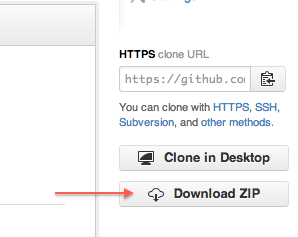

# Data Science with R workshop  
The Genome Analysis Center (TGAC)  
September 6th, 9am - 5pm

Welcome to the GitHub repository for the rOpenSci workshop on data science using R. For this workshop you will be using the current version of R (`3.0.1`) along with the [RStudio](http://www.rstudio.com/) integrated development environment (IDE). We will provide a hosted version of both for this workshop. 

## Schedule 
| Time slot | Topic |
| -------- | ------- | 
| 09.00-09.30 | Coffee and Registration  |
| 09.30-11.00 | Session 1 **[Introduction to R, data structures]**  |
| 11.00-11.15 | Coffee Break  |
| 11.15- 13.00 | Session 2 **[Data manipulation in R, functions and other control structures]** |
| 13:00-13.30 | Lunch  |
| 13.30-15.00 | Session 3 **[Data visualization in R]**  |
| 15.00-15.15 | Coffee Break  |
| 15.00-16.45 | Session 4 **[Acquiring data from the web in R, reproducible research workflows]**  |
| 16.45-17.00 | Wrap-up |

----

# Logging into the RStudio environment

### [http://rstudio.ropensci.org](http://rstudio.ropensci.org)

and use the credentials provided to you.

---

## How to download this repository

If you know how to use GitHub, then simply clone this repository. Otherwise click on the **Download Zip** button on the right side menu at the top of this page.

## License  
<a rel="license" href="http://creativecommons.org/licenses/by/2.0/">Creative Commons Attribution 2.0 Generic License</a>.
